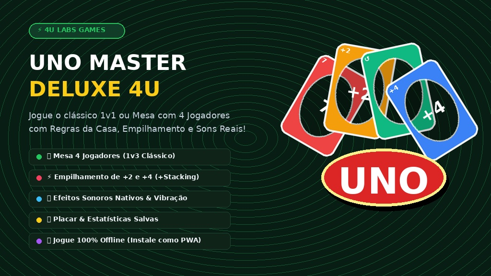

# 🎴 UNO Master Deluxe 4U — Jogo de Cartas Moderno & PWA

<div align="center">

[](https://orcid.org/0009-0004-5936-5060)


<br>



<br><br>

[**🎮 Jogar UNO Deluxe Online**](https://4u.ia.br/app/uno/) • [**4U.IA.BR**](https://4u.ia.br)

</div>

---

## ⚡ Visão Geral

O **UNO Master Deluxe 4U** é uma versão web avançada, responsiva e ultrarrápida do clássico jogo de cartas UNO. Desenvolvido com HTML5, CSS3 moderno com tema de feltro verde de cassino, sintetizador de som nativo via Web Audio API e arquitetura PWA offline.

---

## ✨ Recursos Principais

* 👥 **Mesa Flexível (1v1 ou 4 Jogadores):** Alterne entre duelo rápido contra 1 bot ou mesa completa com 4 jogadores (Você vs West, North e East bots).
* 🔄 **Indicador Dinâmico de Sentido:** Visualizador holográfico do fluxo de jogadas (Horário ↻ e Anti-horário ↺) com animação suave ao jogar cartas de inversão.
* 🇧🇷 **Regras da Casa Configuráveis:**
  * 💥 **+2 / +4 Acumulativo (+Stacking):** Responda a uma carta de compra com outra equivalente para passar o acúmulo ao próximo jogador.
  * 🔄 **Regra do 7 e 0:** Jogar 7 permite escolher um oponente para trocar todas as cartas da mão; jogar 0 roda as mãos de todos no sentido da rodada.
  * 🃏 **Comprar até poder jogar:** Modo onde o jogador segue comprando até obter uma carta válida.
* 🤖 **Inteligência Artificial Tática com 3 Níveis:**
  * 🟢 **Casual:** Jogadas descontraídas e aleatórias.
  * 🟡 **Normal:** Jogo equilibrado e conservador.
  * 🔴 **Master:** IA agressiva que memoriza cores, previne vitórias adversárias e guarda curingas para momentos decisivos.
* 🔊 **Sintetizador de Áudio Nativo (Web Audio API):**
  * Zero dependência de arquivos externos MP3/WAV.
  * Efeitos sonoros sintetizados para compra, descarte na mesa, penalidades, grito de "UNO!", fanfarras de vitória e derrota.
  * Controle instantâneo de mudo (Mute/Unmute).
* 🎊 **Celebração & Efeitos Visuais:**
  * Chuva de confetes coloridos em Canvas na vitória.
  * Feedback tátil por vibração em celulares (`navigator.vibrate`).
  * Cartas jogáveis com brilho pulsante dourado permanente para fácil identificação.
* 📊 **Estatísticas Persistentes (`localStorage`):** Histórico de vitórias, derrotas, taxa de vitória (%) e maior sequência de vitórias (Win Streak).
* 📱 **PWA Instalável & Offline:** Service Worker pré-cacheia todos os assets, permitindo jogar mesmo sem conexão à internet.

---

## 🗂️ Estrutura do Projeto

```text
uno/
├── index.html            # Aplicação completa com UI feltro, lógica do jogo e sons
├── manifest.json         # Manifesto PWA com metadados e atalhos
├── service-worker.js     # Cache offline de assets e lógica PWA
├── banner-16-9.jpg       # Banner oficial em alta resolução
├── icon-512.png          # Ícone PWA 512x512
├── icon-192.png          # Ícone PWA 192x192
├── apple-touch-icon.png  # Ícone para dispositivos iOS 180x180
├── favicon.png           # Favicon do navegador 64x64
└── README.md             # Documentação oficial
```

---

## 🚀 Como Jogar

1. Acesse **[4u.ia.br/app/uno/](https://4u.ia.br/app/uno/)**.
2. Clique no ícone de engrenagem ⚙️ para personalizar as **Regras da Casa** e a dificuldade dos bots.
3. Escolha o modo de mesa (**1v1** ou **Mesa com 4 Jogadores**).
4. No seu turno, clique sobre qualquer carta da sua mão que combine em **cor**, **número** ou que seja uma **carta especial/curinga**. Se não tiver carta jogável, clique no **Baralho de Compra**.
5. Não se esqueça de apertar o botão **Gritar UNO!** quando restar apenas uma carta em sua mão!

---

## 📄 Licença & Autoria

© 2026 **4U.IA.BR** • Desenvolvido com carinho para o ecossistema 4U.
